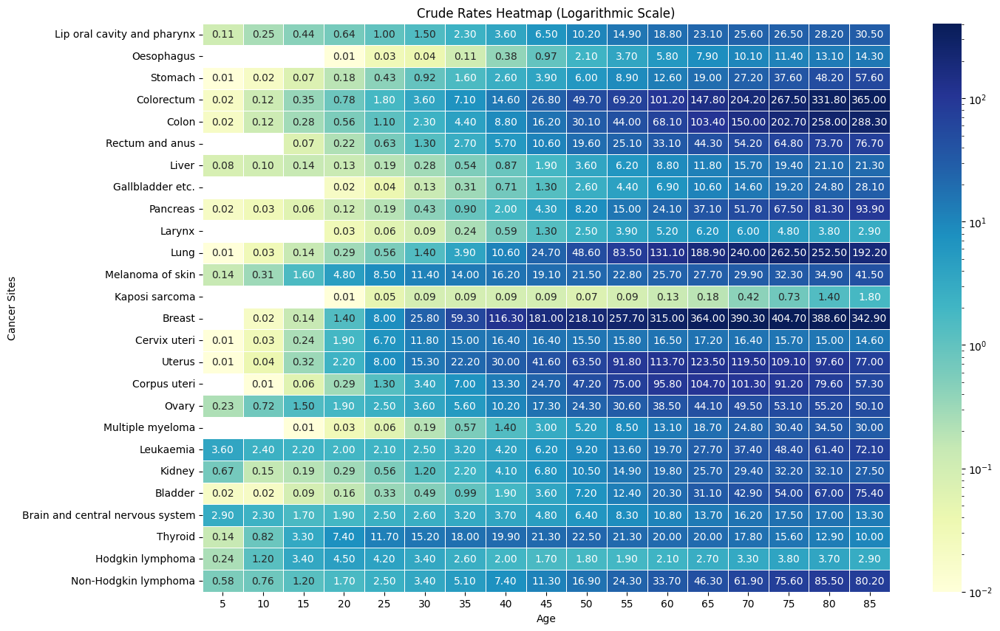

# Cancer-Trends

Purpose:  visualization of cancer trends in women based on the age serves as an invaluable asset to the medical community. IT helps doctors take better care of patients, it's like having a map that shows where and how different types of cancer happen in women at different ages.This representation helps doctors understand the unique challenges and needs of patients in each age group, allowing them to provide more personalized and caring treatment , in addition  learning more about the changing patterns of cancer in woman.

